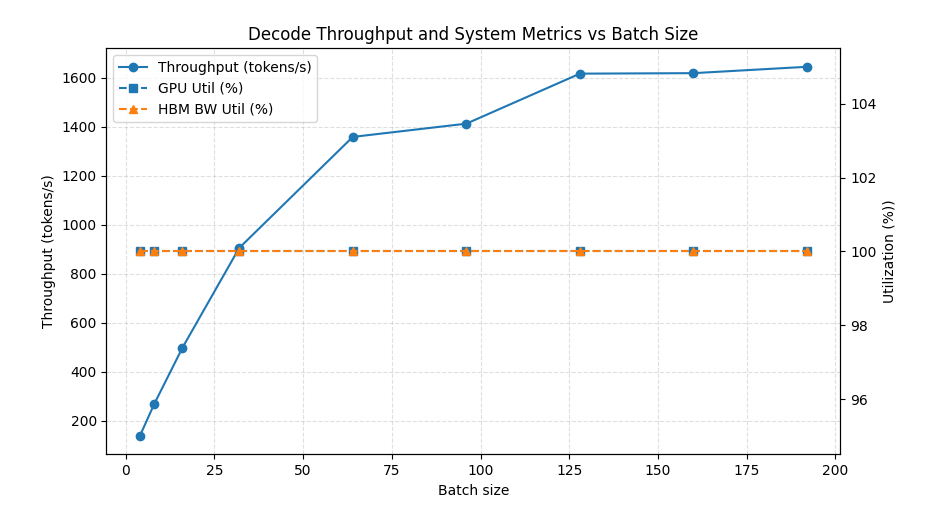
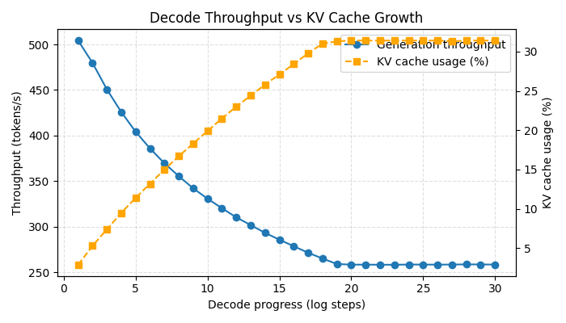

# Understanding vLLM Inference Performance on Single GPU: A Practical Benchmark Study

## Key Takeaways

1. Prefill and decode are fundamentally different from a performance perspective.

    **Prefill is compute-bound.** Prefill achieves high arithmetic intensity, and it is relatively easy to reach good compute utilization with a reasonable sequence length or by increasing batch size. This is why many AI providers charge prompt processing cheaper than token generation.

    **Decode is memory bandwidth-bound.** Increasing batch size can help other components, but not the attention operation. The arithmetic intensity of attention during decoding is always low and constant. As a result, decode throughput initially scales with batch size, but eventually saturates due to KV-cache memory bandwidth limitations.

2. Kernel launch overhead is expensive and should be amortized.**

3. Increasing sequence length is expensive for performance, especially during decoding.
Since decoding is already memory-bound, increasing sequence length directly reduces throughput. To generate each token, the model must load the KV cache for all previous tokens. This is why context length is limited in practice.

---

## Motivation

This post benchmarks vLLM using concrete experiments to verify and internalize several performance takeaways and intuitions from my recent study.  
The experiments focus on a single-node, single-GPU setup, and evaluate throughput as the primary metric, as this is an offline benchmark.

---

## Experimental Setup

**Model.**  
All experiments use `mistralai/Mistral-7B-v0.1`. This model was intentionally chosen because its size and design make it representative enough for real-world inference workloads, while remaining practical to benchmark on a single GPU.

**Hardware.**  
I used a single NVIDIA A40 GPU. This choice is also intentional: it was the cheapest one available when I opened RunPod : )

**Metric.**  
As this is an offline benchmark, throughput (tokens/s) is used as the primary client-facing performance metric. In addition, internal metrics are recorded for analysis, including GPU HBM bandwidth, power consumption, and KV-cache statistics.

---

## Experiment 1: Batch Size vs Decode Throughput

**Setup.**  
A synthetic workload with random prompts is used. The prompt length is fixed at 64 tokens, and the generation length is fixed at 512 tokens. This configuration makes the workload decode-heavy, while avoiding excessively long sequences that could introduce large throughput fluctuations. All other settings are kept fixed, and batch size is varied across [4, 8, 16, 32, 64, 96, 128, 160, 192], while measuring throughput and other internal metrics.

**Insights.**

1. Decode throughput increases with batch size and reaches a clear plateau beyond batch size 128. Before entering the plateau, throughput remains stable across runs, with no significant fluctuations observed.

2. GPU resources remain fully saturated throughout the experiment: GPU utilization, HBM bandwidth, and power consumption stay at their maximum levels across all batch sizes. Contrary to the common expectation of seeing one resource saturated while another remains underutilized, all major GPU resources are simultaneously driven to their limits. Notably, 100% GPU utilization in this regime does not imply a compute-bound workload, but rather reflects sustained execution of memory-bound kernels during decoding.

---

## Experiment 2: Decode Sequence Length vs Throughput
**Setup.**  
Batch size is fixed at 16. A synthetic workload with random prompts is used, with a fixed prompt length of 64 tokens and an extended generation length of 9,096 tokens. This configuration isolates the effect of decode sequence length by making the workload overwhelmingly decode-dominant.

**Result.**  
Decode throughput decreases monotonically as decoding progresses and eventually converges to a stable steady-state value.

**Insight.**  
This behavior reflects the memory-bound nature of decoding. As the KV cache grows with each generated token, the per-token attention cost increases due to larger KV reads. Once HBM bandwidth is fully saturated, the system reaches a steady state where throughput stabilizes despite further increases in sequence length.
